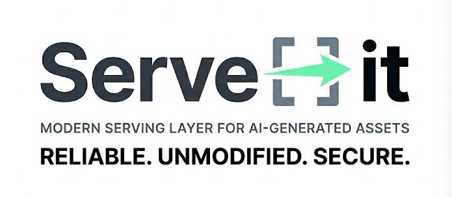

<div align="center">



</div>


Serve-it is a high-performance, multi-tenant file sharing and serving platform. It enables organizations to create isolated workspaces, manage assets securely, assign API keys for automated ingestion, and serve HTML pages via custom short URLs.

---

## 🛠️ Technology Stack

   
   
   
   
   
   
   
   

---

## 📖 Domain Documentation

The application's core functionality is organized into distinct business domains. Explore the documentation below:

1. **[Authentication Domain](./docs/domains/auth.md)**: Manages SSO session configurations, NextAuth integration, and developer login overrides.
2. **[Workspaces & Multi-Tenancy](./docs/domains/workspaces.md)**: Explains workspace separation, tenant isolation logic, and platform role authorizations.
3. **[File Management & Storage](./docs/domains/files.md)**: Outlines file upload modal workflows, validation requirements, and storage bucket bindings.
4. **[Document Serving Layer](./docs/domains/serving.md)**: Details the dynamic short URL serving router, HTTP content types, and cache control policies.
5. **[API Keys & Programmatic Ingestion](./docs/domains/apikeys.md)**: Covers cryptographically secure API key generation, secure SHA-256 database hashing, and Bearer token ingestion endpoints.
6. **[Google Cloud Deployment](./docs/deployment.md)**: Guide on deploying the application to Google Cloud Run via GitHub Actions.

---

## 🚀 Getting Started

### 1. Prerequisites
- Docker & Docker Compose
- Node.js (v20+)
- pnpm

### 2. Startup
1. Environment Setup:
   Copy the example environment variables file and fill in your values, particularly for Microsoft Entra ID (Azure AD) if you wish to test SSO.
   ```bash
   cp .env.example .env
   ```
2. Run local dependencies:
   ```bash
   docker compose up -d
   ```
2. Run Prisma migrations & seed database:
   ```bash
   npx prisma db push
   npx prisma db seed
   ```
3. Run the Next.js development server:
   ```bash
   pnpm run dev
   ```
4. Access the sign-in page at `http://localhost:3000/auth/signin`. In development mode, you can click "Bypass: Sign in as Developer Admin" to skip SSO. Otherwise, use Microsoft Entra ID with the configured `.env` credentials.

---

## 🔐 Microsoft Entra ID (Azure AD) SSO Setup

To enable login with Microsoft Entra ID, you must configure your application in the Azure Portal and provide the credentials in your `.env` file.

1. Register a new application in Microsoft Entra ID.
2. Under "Authentication", add a Web redirect URI pointing to: `http://localhost:3000/api/auth/callback/azure-ad` (or your production URL).
3. Under "Certificates & secrets", create a new client secret.
4. Update your `.env` file with the copied values:
   - `AZURE_AD_CLIENT_ID`: Application (client) ID
   - `AZURE_AD_CLIENT_SECRET`: Your generated client secret
   - `AZURE_AD_TENANT_ID`: Directory (tenant) ID (Providing this restricts login to users from your specific tenant).
