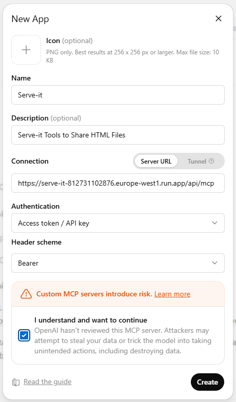
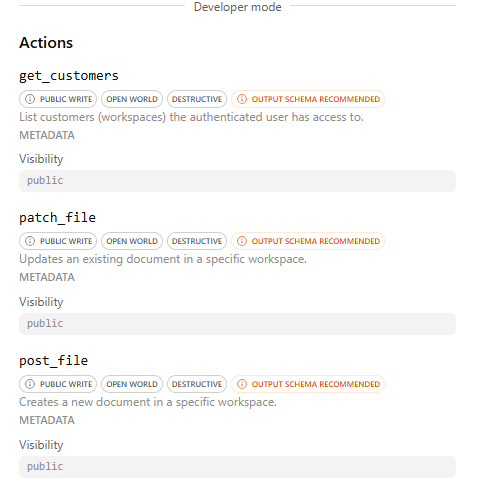

# MCP Integration Guide

This guide walks workspace administrators through setting up Serve-it's Model Context Protocol (MCP) integration, enabling AI assistants to manage files within their workspace programmatically.

---

## 1. Introduction

The **Model Context Protocol (MCP)** is an open standard that allows AI assistants (such as ChatGPT, Claude, or Cursor) to interact with external tools and services through a unified interface. Serve-it implements an MCP server that exposes file management operations as tools, allowing AI assistants to:

- **List workspaces** the authenticated user has access to.
- **Upload new documents** (HTML files) to a workspace with metadata and tags.
- **Update existing documents** — modify content, titles, tags, or metadata.

All operations are authenticated via API keys and scoped to the workspace associated with the key.

---

## 2. Prerequisites

Before configuring MCP, ensure the following:

1. **Active Workspace:** Your organization must have an active customer workspace in Serve-it. Contact your platform administrator if you don't have one.
2. **API Key:** You need a valid API key (`sk_serve_...`) generated from the admin panel. API keys are shown **once** at creation — store it securely.
3. **MCP Server URL:** Your Serve-it deployment's MCP endpoint. The URL follows the pattern:
   ```
   https://<your-serve-it-domain>/api/mcp
   ```

> **Note:** If you don't have an API key, ask your workspace administrator to generate one from **Admin Panel → Customers → Generate API Key**.

---

## 3. Authentication Setup

Serve-it uses **Access Token / API Key** authentication with the **Bearer** header scheme. When configuring any MCP client, you will need to provide:

| Setting              | Value                          |
|----------------------|--------------------------------|
| **Authentication**   | `Access token / API key`       |
| **Header Scheme**    | `Bearer`                       |
| **Token Value**      | Your API key (`sk_serve_...`)  |

The MCP client sends this token with every tool call:
```
Authorization: Bearer sk_serve_<your_key_here>
```

The server hashes the token with SHA-256 and looks up the matching record in the database. If valid, the tool call proceeds within the workspace associated with that API key.

> **Security Note:** API keys are never stored in plaintext. Only the SHA-256 hash is persisted in the database. Treat your API key like a password — do not share it or commit it to version control.

---

## 4. ChatGPT Custom App Setup

Follow these steps to connect Serve-it to ChatGPT as a custom MCP app:

### Step 1: Open the ChatGPT App Store

1. In ChatGPT, navigate to the **Apps** or **GPTs** section.
2. Select **"Create New App"** or **"Add Custom App"**.

### Step 2: Configure the App

Fill in the following fields in the "New App" dialog:

| Field              | Value                                                    |
|--------------------|----------------------------------------------------------|
| **Name**           | `Serve-it`                                               |
| **Description**    | `Serve-it Tools to Share HTML Files`                      |
| **Connection**     | Select **Server URL**                                    |
| **Server URL**     | `https://<your-serve-it-domain>/api/mcp`                 |
| **Authentication** | `Access token / API key`                                 |
| **Header scheme**  | `Bearer`                                                 |

### Step 3: Acknowledge Security Warning

ChatGPT will display a warning: **"Custom MCP servers introduce risk."** Check the acknowledgment checkbox to proceed.

### Step 4: Create the App

Click **"Create"** to register the Serve-it MCP app.

### Reference: ChatGPT Setup Dialog

The completed setup dialog should look like this:



### Step 5: Enter Your API Key

After creating the app, ChatGPT will prompt you to enter your API key. Paste your full API key (`sk_serve_...`) into the token input field.

### Step 6: Verify Available Tools

Once connected, ChatGPT will display the available Serve-it tools in **Developer mode**. You should see the following actions:



---

## 5. Available MCP Tools

Once the MCP connection is established, the following tools are available to the AI assistant:

### `get_customers`

Lists the customer workspaces the authenticated API key has access to.

| Property      | Details                                                          |
|---------------|------------------------------------------------------------------|
| **Method**    | Read-only                                                        |
| **Parameters**| None                                                             |
| **Returns**   | List of workspaces (id, name, slug, active status)               |
| **Use Case**  | Discover available workspaces before uploading files.             |

### `post_file`

Creates a new document in a specific workspace.

| Property       | Details                                                          |
|----------------|------------------------------------------------------------------|
| **Method**     | Write (POST)                                                     |
| **Required**   | `title` (string), `slug` (string), `file` (HTML content)        |
| **Optional**   | `tags` (JSON array), `metadata` (JSON object)                   |
| **Returns**    | Created file record with public URL (`/s/<workspace>/<slug>`)    |
| **Constraints**| Slug must be unique within the workspace. Returns `409` if duplicate. |

### `patch_file`

Updates an existing document in a specific workspace.

| Property       | Details                                                          |
|----------------|------------------------------------------------------------------|
| **Method**     | Write (PATCH)                                                    |
| **Required**   | `slug` (string) — identifies the file to update                 |
| **Optional**   | `title`, `file` (new content), `tags`, `metadata`               |
| **Returns**    | Updated file record with public URL                              |
| **Constraints**| At least one optional field must be provided. Returns `404` if slug not found. |

---

## 6. Troubleshooting

### Connection Errors

| Symptom | Possible Cause | Resolution |
|---------|---------------|------------|
| "Failed to connect to MCP server" | Incorrect Server URL or Serve-it is unreachable. | Verify the MCP endpoint URL is correct and the server is running. Check network connectivity. |
| "Unauthorized" (401) | API key not provided or malformed Bearer header. | Ensure the API key is entered correctly in the MCP client authentication settings. |
| "Invalid API Key" (403) | API key does not match any stored record. The key may have been revoked or mistyped. | Generate a new API key from the admin panel and reconfigure the MCP client. |

### Tool Execution Errors

| Symptom | Possible Cause | Resolution |
|---------|---------------|------------|
| "Customer workspace is inactive" (403) | The workspace associated with the API key has been deactivated. | Contact the platform administrator to re-enable the workspace. |
| "A file with this slug already exists" (409) | Attempted to upload a file with a slug that already exists. | Use a different slug, or use `patch_file` to update the existing file instead. |
| "File not found" (404) | The slug provided for `patch_file` does not match any file in the workspace. | Verify the slug matches an existing file. Use `get_customers` to confirm the workspace context. |
| "Missing required fields" (400) | A tool call is missing required parameters (`title`, `slug`, or `file`). | Ensure the AI assistant provides all required fields. Rephrase the prompt to be more explicit. |
| "Internal server error" (500) | Unexpected server-side failure. | Retry the operation. If the error persists, check server logs or contact the administrator. |

### General Tips

- **API keys are single-use secrets.** If you lose your key, generate a new one from the admin panel.
- **Slug uniqueness is per-workspace.** Different workspaces can have files with the same slug.
- **File content is HTML.** The AI assistant should generate valid HTML when creating or updating documents.
- **Public URLs** follow the pattern: `https://<your-domain>/s/<workspace-slug>/<file-slug>`.
